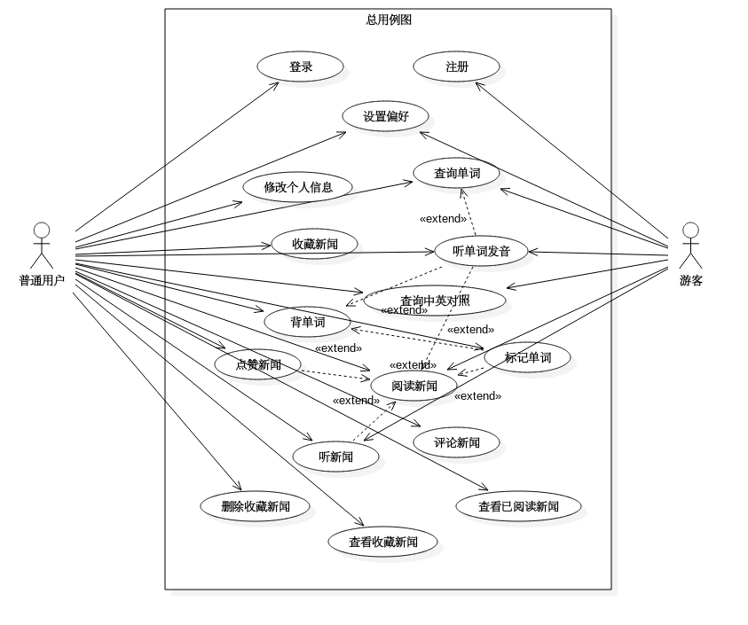
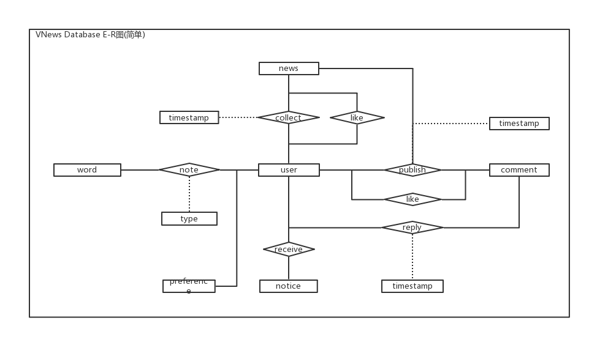

# VNews-SpringBoot

### Introduction
​	我们的 App 以英语新闻阅读为主，我们会为用户提供高质量的英语新闻文章，用户不仅可以锻炼自己的英语阅读能力，也可以从中了解时事政治，或者是有趣的文章。围绕着这一主题，我们还可以实现单词查询，发音，摇一摇背单词，以及单词文章标记收藏、回顾等功能，当然，用户还可以通过评论进行互动。

### Use case Diagram



### Contents

- 新闻
  - 浏览 
  - 收藏
  - 评论
  - 阅读
- 单词
  - 查询
  - 详情
  - 收藏
  - 复习
- 通知
  - 评论
- 用户
  - 注册 
  - 登录
  - 足迹
  - 设置

#### 数据库设计
E-R图
 
SQL Script
```
<!-- 新闻实体数据 -->
CREATE TABLE IF NOT EXISTS news (
    ID          INT AUTO_INCREMENT,
    title       VARCHAR(255)   NOT NULL ,
    author      VARCHAR(50),
    description VARCHAR(255),
    image       VARCHAR(255) COMMENT 'image url',
    publishedAt DATETIME     COMMENT 'publish date',
    source      VARCHAR(50),
    content     TEXT           NOT NULL COMMENT 'the content of news',
    level       VARCHAR(50),
    type        VARCHAR(50),
    PRIMARY KEY (ID)
)ENGINE = INNODB DEFAULT CHARSET = utf8
<!-- 单词实体数据 -->
CREATE TABLE IF NOT EXISTS words (
  ID       INT(20) AUTO_INCREMENT
    PRIMARY KEY,
  word     VARCHAR(100)        NOT NULL,
  exchange VARCHAR(1000)       NULL,
  voice    VARCHAR(1000)       NULL,
  times    INT(20) DEFAULT '1' NULL
);
CREATE TABLE IF NOT EXISTS pos (
  ID    INT(2) AUTO_INCREMENT
    PRIMARY KEY,
  name  VARCHAR(20) NULL,
  means VARCHAR(45) NULL
);
CREATE TABLE IF NOT EXISTS means (
  wordID INT(20)       NOT NULL,
  posID  INT(2)        NOT NULL,
  means  VARCHAR(1000) NULL,
  CONSTRAINT fk_means_1
  FOREIGN KEY (wordID) REFERENCES words (ID),
  CONSTRAINT fk_means_2
  FOREIGN KEY (posID) REFERENCES pos (ID)
);

CREATE INDEX fk_means_1_idx
  ON means (posID);

CREATE INDEX fk_means_1_idx1
  ON means (wordID);

CREATE TABLE IF NOT EXISTS missing (
    ID   INT(20) AUTO_INCREMENT
      PRIMARY KEY,
    word VARCHAR(200) NOT NULL
);
<!-- 用户实体数据 -->
CREATE TABLE IF NOT EXISTS user (
  ID        VARCHAR(20)   NOT NULL,
  username  VARCHAR(50)   NOT NULL,
  password  VARCHAR(255)  NOT NULL,
  email     VARCHAR(50)   NOT NULL,
  sex       VARCHAR(4)    NULL,
  birthday  DATE          NULL,
  image     VARCHAR(255)  NULL,
  telephone VARCHAR(11)   NULL,
  motto     VARCHAR(100)  NULL,
  info      TEXT NULL,
  PRIMARY KEY(ID)
)ENGINE = INNODB DEFAULT CHARSET = utf8;
<!-- 新闻评论实体数据 -->
CREATE TABLE IF NOT EXISTS comment (
  ID        INT           AUTO_INCREMENT PRIMARY KEY,
  fromID    INT           REFERENCES user(ID),
  toID      INT           REFERENCES user(ID),
  content   TEXT          NOT NULL,
  timestamp TIMESTAMP     NOT NULL,
  newsID    INT           REFERENCES news(ID)
)ENGINE=InnoDB  DEFAULT CHARSET=utf8;
<!-- 新闻通知实体数据 -->
CREATE TABLE IF NOT EXISTS notice (
  ID        INT           AUTO_INCREMENT PRIMARY KEY,
  newsID    INT           REFERENCES news(ID),
  fromID    INT           REFERENCES user(ID),
  toID      INT           REFERENCES user(ID),
  content   TEXT          NOT NULL,
  timestamp TIMESTAMP     NOT NULL
)ENGINE=InnoDB  DEFAULT CHARSET=utf8;

<!-- 新闻类型实体数据 -->
CREATE TABLE IF NOT EXISTS type (
  ID        INT           AUTO_INCREMENT PRIMARY KEY,
  name      VARCHAR(50)   NOT NULL
)ENGINE=InnoDB  DEFAULT CHARSET=utf8;
<!-- 用户偏好数据 -->
CREATE TABLE IF NOT EXISTS user_preference (
  userID        VARCHAR(20)      REFERENCES user(ID),
  typeID        INT              REFERENCES type(ID),
  preference    INT              DEFAULT 0,
  PRIMARY KEY (userID, typeID)
)ENGINE=InnoDB  DEFAULT CHARSET=utf8;
<!-- 新闻点赞数据 -->
CREATE TABLE IF NOT EXISTS like_news (
  userID        VARCHAR(20)      REFERENCES user(ID),
  newsID        INT              REFERENCES news(ID),
  timestamp     TIMESTAMP        NOT NULL,
  PRIMARY KEY (userID, newsID)
)ENGINE=InnoDB  DEFAULT CHARSET=utf8;
<!--收藏单词记录-->
CREATE TABLE IF NOT EXISTS collect_words (
  userID        VARCHAR(20)      REFERENCES user(ID),
  wordID        INT              REFERENCES words(ID),
  tag           VARCHAR(50)      NOT NULL,
  timestamp     TIMESTAMP        NOT NULL,
  PRIMARY KEY (userID, wordID)
)ENGINE=InnoDB  DEFAULT CHARSET=utf8;
<!--评论点赞记录-->
CREATE TABLE IF NOT EXISTS like_comment (
  userID        VARCHAR(20)      REFERENCES user(ID),
  commentID     INT              REFERENCES comment(ID),
  timestamp     TIMESTAMP        NOT NULL,
  PRIMARY KEY (userID, commentID)
)ENGINE=InnoDB  DEFAULT CHARSET=utf8;
<!-- 新闻浏览记录-->
CREATE TABLE IF NOT EXISTS view_news (
  newsID        INT        REFERENCES news(ID),
  count         INT,
  PRIMARY KEY (newsID)
)ENGINE=InnoDB  DEFAULT CHARSET=utf8;

```

### Vnews' restful interfaces Documents
---
**访问格式为：**http://ip:port/vnews/path

#### 一、用户系统
- 登录 　　  POST
   路径：　　/login
   提交数据：

   ```{
   {
   	"username":"", 
   	"password":""
   }
   ```
   返回值
   ```
   {
      "code":"200",
      "message":"",
      "content":
   }
   ```

- 注册 　　　POST
  路径：　　register
  提交数据：

  ```{
  {
  	"telephone":""
  	"username":""
  	"password":""
  }
  ```
  返回值：　

  ```
  {
    "code":"200",
    "message":"success",
    "content":('ID':暂定为电话号码)
  }成功
  {
    "code":"500",
    "message":"telephone error",
    "content":
  }电话号码重复
  {
    "code":"500",
    "message":"username error",
    "content":
  }用户名重复
  ```

- 检测手机账号是否存在 GET
  路径：　　user/tel/{telephone}
  返回值：　{'code':'200','message':'success','content':array()}不存在
  {'code':'500','message':'telephone error','content':array()}存在

- 更新用户信息 PUT (优先PUT, 或者POST) 默认只能修改除了ID，telephone的其他八条信息）
   路径：　　user/{username}
    提交数据：{map} (一个map的映射关系)
    返回值：　{'code':'200',','message':'success','content':array()}成功
   {'code':'500','message':'username error','content':array()}无该用户名
   {'code':'500','message':'information error','content':array()}缺少必要信息
   {'code':'500','message':'new username error','content':array()}新用户名已经注册

 - 上传图片 　　POST未完成
    路径：　　user/{username}/image
     提交数据：文件
     返回值：　json{code:?} 0代表成功 1代表失败

 - 获取用户信息 GET
    路径：　　user/{username}
     返回值：　{'code':'500','message':'username error','content':array()}无该用户名
    {'code':'200','message':'success','content':array(所有的数据的json格式，共十条，分别为ID,username,password,email,sex,birthday,image,telephone,motto,info)}

#### 二、新闻系统 (按发布时间排序)
- 获取新闻列表按类别   GET　
  路径：　　news/{category}　(category缺省则获取全部类型这个不知道怎么实现)category和type比较
  提交数据：{start, count}
  {'code':'200','message':'success','content':array(多个json对象，news表单里所有的信息以json格式分别为ID,title,author,description,image,publishedAt,source,content,level,type)

- 获取最热的新闻列表   GET
  路径：　　news/hots
  提交数据：{count}
  返回值：　json{'code':'200','message':'success','content':{若干个新闻信息对象的所有信息}};
  json{'code':'500','message':'empty error','content':array()};数据库为空
  json{'code':'500','message':'not found error','content':{}}} view_news和news不一致

- 获取新闻详情 GET
  路径：　　news/id
  提交数据: {id}
  返回值：　{'code':'200','message':'news_id error','content':{所有信息};

- 个人喜欢新闻列表 GET
  路径：　　news/{user_id}/likes
  提交数据：{category:?, start:?, count:?} (待定)
  返回值：　json{} 新闻简单列表 news_id, title, description, imageurl.

- 添加喜欢新闻 POST
  路径：　　news/{user_id}/like/{news_id}
  返回值：　json{code:?} 0代表成功 1代表失败

- 检查是否喜欢某个新闻 GET
  路径：　　news/{user_id}/like/{news_id}
  返回值：　json{code:?} 0代表喜欢 1代表不喜欢

- 浏览新闻 POST
  路径：　　news/view/{news_id}
  提交数据：{user_id:?}
  返回值：　json{code:?} 0代表成功 1代表失败

- 删除个人喜欢新闻 DELETE
  路径：　　news/{user_id}/like/{news_id}
  返回值：　json{code:?} 0代表成功 1代表失败

#### 二、单词系统

- 查找单词 GET
  路径：　　words/search/{words}
  返回值：　json{map} 单词详情

- 获取标记单词列表 　GET
  路径：　　words/{user_id}/tags
  提交数据：　{tag_type:?，start:?, count:?} (待定)
  返回值：　json{code:?} 0代表成功 1代表失败

- 标记单词 　   POST
  路径：　　words/{user_id}/tag/{words_id}
  提交数据：{tag:?} 标记类型
  返回值：　json{code:?} 0代表成功 1代表失败

- 更改标记单词 PUT
  路径：　　words/{user_id}/tag/{words_id}
  提交数据： {tag_type:?}
  返回值：　json{code:?} 0代表成功 1代表失败

- 删除标记单词 DELETE
  路径：　　words/{user_id}/tag/{words_id}
  返回值：　json{code:?} 0代表成功 1代表失败

#### 三、评论系统

- 添加评论　POST
  路径：　　news/comment
  提交数据：　{news_id:?，username:?, to_user_id:?} (to_user_id可以为空)
  返回值：　json{code:?} 0代表成功 1代表失败

- 获取某个新闻的评论　GET
  路径：　　news/comments/{news_id}
  提交数据：　{start:?, count:?}
  返回值：　json{map} 返回评论列表

- 喜欢某个新闻的评论　GET
  路径：　　news/comment/{comment_id}/like
  提交数据：　{user_id:?}
  返回值：　json{code:?} 0代表成功 1代表失败

- 取消某个新闻的评论　DELETE
  路径：　　news/comment/{comment_id}/like
  提交数据：　{user_id:?}
  返回值：　json{code:?} 0代表成功 1代表失败

#### 四、用户偏好

- 添加偏好　POST
  路径：　　user/{user_id}/preference
  提交数据：　{preference:?} ? 可表示　world,business以逗号分割
  返回值：　json{code:?} 0代表成功 1代表失败

- 更改偏好　PUT
  路径：　　user/{user_id}/preference
  提交数据：　{preference:?} ? 可表示　world,business以逗号分割
  返回值：　json{code:?} 0代表成功 1代表失败

- 获取偏好　GET
  路径：　　user/{user_id}/preference
  返回值：　json{map} 喜好列表

### Contributor
- [寸宣堂 1552730](https://github.com/wzes)
- [师凯杰 1552736](https://github.com/Anifled)
- [杜若衡 1552649](https://github.com/Wortspiedrh)
